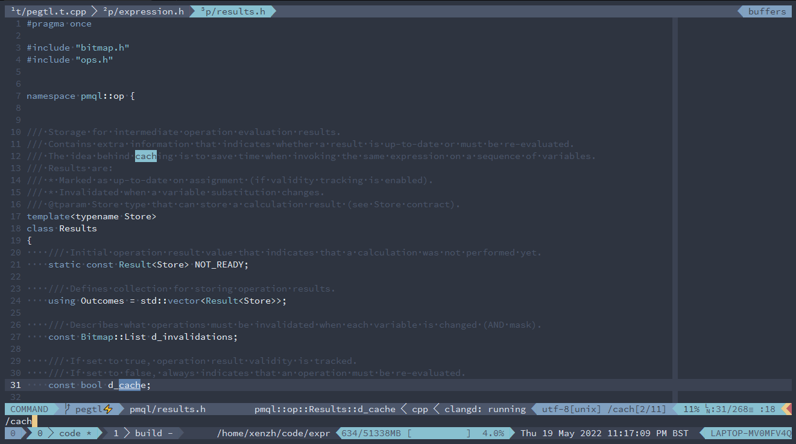

# My trusty dotfiles

Features:

* `zsh` configuration (based on `oh-my-zsh`).
* `tmux` configuration.
* `nvim` configuration and plugins for C++/python/Rust development (almost fully `vim` compatible).
* shell aliases and tools.

Documentation:

* [What's inside](docs/WHATS\_INSIDE.md)
* [Mappings and commands](docs/MAPPINGS.md)



## Installation

### Automatic

```
git clone https://github.com/xenzh/myvimrc.git ~/.dotfiles
cd ~/.dotfiles
./install.sh
```

### Manual

1. Clone this repo to `~/.dotfiles` folder and get the submodules

```
git clone https://github.com/xenzh/myvimrc.git ~/.dotfiles
cd ~/.dotfiles
git submodule update --init --recursive --remote
```

2. Install [nord theme](https://www.nordtheme.com/) port for the terminal emulator.

3. Make symlinks / source scripts

```
ln -s ~/.dotfiles/vim/.vimrc ~/.vimrc
cp ~/.dotfiles/vim/init.vim ~/.config/nvim

ln -s ~/.dotfiles/.tmux.conf ~/.tmux.conf

ln -s ~/.dotfiles/.zshrc ~/.zshrc
```

## How to add, remove and update submodules

```sh
# pull all submodules
git submodule update --init --recursive --remote

# add a submodule (use to http to bypass corp MITM)
git submodule add http://<git_repo>

# remove a submodule
git rm <path-to-submodule>
```
