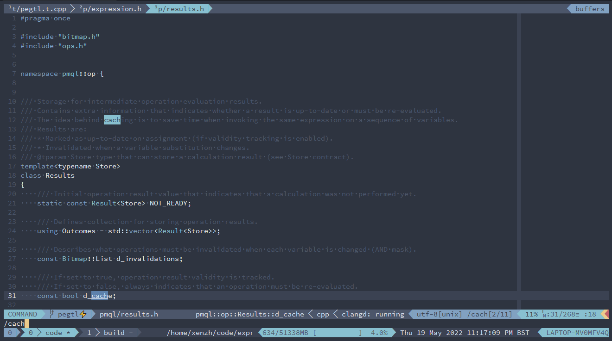

# My trusty dotfiles

Features:

- Configurations for `zsh` (`oh-my-zsh` based) and `nushell`, aliases and themes.
- Tools managed by `mise`.
- `neovim` configuration and plugins for C++/Rust/python development (partially compatible with `vim`).
- A basic `tmux` setup.
- An assortment of custom tools.

Documentation:

* [What's inside](docs/WHATS\_INSIDE.md)
* [Mappings and commands](docs/MAPPINGS.md)



## Installation

### Automatic

```sh
git clone https://github.com/xenzh/myvimrc.git ~/.dotfiles
cd ~/.dotfiles
./dotfiles install
```

Afterwards, keep mise-managed tools and submodules up to date with:

```sh
./dotfiles update
```

### Manual

1. Clone this repo to `~/.dotfiles` folder and get the submodules

```sh
git clone https://github.com/xenzh/myvimrc.git ~/.dotfiles
cd ~/.dotfiles
git submodule update --init --remote --recursive
```

2. Install [nord theme](https://www.nordtheme.com/) port for the terminal emulator.

3. Make symlinks / source scripts

```sh
ln -s ~/.dotfiles/vim/.vimrc ~/.vimrc
cp ~/.dotfiles/vim/init.vim ~/.config/nvim
echo "source-file ~/.dotfiles/tmux/.tmux.conf" >> ~/.tmux.conf
echo "source ~/.dotfiles/zsh/.zshrc" >> ~/.zshrc
mkdir -p ~/.config/nushell
ln -s ~/.dotfiles/nu/config.nu ~/.config/nushell/config.nu
ln -s ~/.dotfiles/tools/.gdbinit ~/.gdbinit
```

4. Install [mise](https://mise.jdx.dev) and the tools it manages (see `mise/config.toml` for what's covered and what isn't)

```sh
curl -fsSL https://mise.run | sh

mkdir -p ~/.config/mise
ln -s ~/.dotfiles/mise/config.toml ~/.config/mise/config.toml
mise install
```

## How to add, remove and update submodules

```sh
# pull all submodules
git submodule update --init --remote --recursive

# add a submodule (use to http to bypass corp MITM)
git submodule add http://<git_repo>

# remove a submodule
git rm <path-to-submodule>
```
